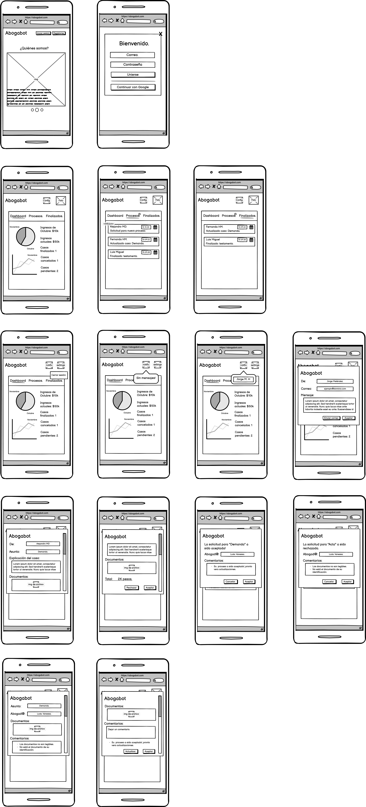

# Abogabot
Práctica Abogabot - LaunchX

## 1.- Toma de requerimientos.
### a. Descripción general del requerimiento.
|  PROYECTO | ABOGABOT  |
|:------------| ------------ |
| Requerimiento.  | Aplicación web Abogabot. |
| Fecha Solicitud.  | 07/10/2022  |
| Responsable Solicitud.  |  LaunchX |
|  Responsable Funcional | David Hernández  |
---
### b. Fase de formalización.
#### **Descripción de solicitud:**

***Solicitante:***
- Es un despacho de abogados que quiere automatizar las demandas de sus clientes, esto lo harán a traves de una página web llenando un formulario.
- Al momento de llenar el formulario se manda al proceso de pago para finalizar la transacción.
- Para dar seguimiento a su demanda, el cliente crea una cuenta en la plataforma y verá el seguimiento de cada una de las actualizaciones del proceso legal.
- El administrador del sitio recibe la notificación de una nueva demanda y con los datos llenados del formulario se crea automaticamente el documento legal en formato word para empezar el proceso.
- El administrador recibe el pago y debe de ser capaz de verlo en un dashboard para ver la cantidad de ingresos recibidos.
- El administrador actualiza el proceso de la demanda y agrega comentarios en cada paso del proceso.
- Al usuario le llegan correos de notificación para saber el avance de su proceso.
- La página debe de ser responsive para poderla ver desde el celular.
- La preferncia de colores del cliente es azul marino y blanco, pero acepta propuestas.
---
***Lider Funcional***
+ Se tiene que desarrollar una aplicación web, donde el usuario pueda administrar de forma sencilla y automática sus procesos legales, y podrá acceder tanto desde su computadora como su dispositivo móvil.
+  Administrador:
	+ El administrador/abogado podrá iniciar sesión en la aplicación web, una vez esto se dirigirá a la ventana especializada para estos, en caso de que no cuente con una cuenta, la empresa le asignara una.
	+ Los administradores tendrán que recibir notificaciones sobre solicitudes de procesos legares de los usuarios, junto con las especificaciones de estos procesos por medio del formulario, y el pago; aquí se tendrá que poner a disposición un sistema para asignar a un abogado el caso.
	+Una vez que el abogado haya aceptado la solicitud, la aplicación creara un documento de Word para su posterior modificación.
	+ Cuando el abogado haya actualizado el documento, este tendrá que redactar un comentario sobre cada paso realizado en el documento.
	+ El abogado en cuestión podrá ver en un dashboard los ingresos que a obtenido mensualmente, seguido de esto podrá ver un historial de los procesos legales, tanto finalizados, como en proceso junto con la cantidad del pago.
+ Usuario:
	+ El usuario al entrar a la página web, este podrá iniciar sesión, en caso de que no cuente con una cuenta, podrá crear una.
	+ El usuario al ingresar a su cuenta, podrá ver varias opciones, la principal será una lista en donde se muestren todos los casos que haya registrado, tanto pendientes como finalizado, contara con tres categorías siendo la anterior la general, las otras dos separara los procesos finalizados y pendientes.
	+ El usuario podrá crear un nuevo proceso legal en la aplicación, tendrá que llenar un formulario especificando el tipo de proceso, características, los documentos necesarios de su caso, y un pequeño resumen para poner al día al abogado que se le asigne.
	+ El usuario al crear la solicitud, la página le pedirá un método de pago, una vez completado se le notificara que todo ha salido correcto, y la pagina lo redirigirá a la página principal.
	+ Este recibirá notificaciones cuando un abogado haya aceptado su solicitud y cuando este haga actualizaciones sobre su caso.
---
### c. Análisis de requisitos y requerimientos.

#### Términos de referencia.
|  Alcance de la solución | El proyecto podrá tener la mayoría de los elementos que se mencionaron en los requerimientos. La parte del usuario estará tal y como se vio por parte de estos, teniendo su página principal, inicio de sesión, registro, y manejo de sus casos, tanto como crear nuevos y auditar los que están en proceso, y de igual manera se le da la oportunidad de poder comunicarse con los abogados. Y por la parte del administrador (abogados), lo que no se hará será que cada uno tenga una cuenta, si no, que el existirá una cuenta la cual puedan manejar todos los abogados, sin embargo, un administrador se encargara de poder repartir los casos a un cierto abogado, este pondrá el nombre del abogado y datos, al querer contactarse con este, se le redirigirá a su correo personal con el destinatario ya predeterminado para que pueda mandar su posterior mensaje, con esto se tendría un mejor manejo por parte de la empresa tanto con las ganancias (ya que son solo 11). |
|:-:|:-|
## 1.1.- Buyer persona.
Cliente ideal de la aplicación web.

## 2.- Público objetivo.
El publico objetivo el cual esta destinado que la aplicación web llegue.

## 3.- Wireframes.
### Wireframes Usuario.
#### Wirefreme Usuario pc:

#### Wireframe Usuario mobil:

### Wireframes Administrador.
#### Wireframe Administrador pc:

#### Wireframe Administrador mobil:

